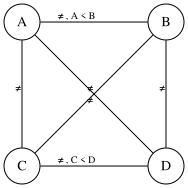

# Assignment 1

## Part A: Search problem data

### A1

|                      |             BFS              |          DFS          |                UCS                |
|:---------------------|:----------------------------:|:---------------------:|:---------------------------------:|
| Removal Order        | `S`, `A`, `B`, `C`, `D`, `G` |  `S`, `A`, `C`, `G`   |   `S`, `B`, `A`, `C`, `D`, `G`    |
| Returned S-to-G Path |    `S` → `A` → `C` → `G`     | `S` → `A` → `C` → `G` | `S` → `B` → `A` → `C` → `D` → `G` |
| Total Cost           |       $4 + 1 + 5 = 10$       |   $4 + 1 + 5 = 10$    |      $1 + 1 + 1 + 1 + 2 = 6$      |

Frontier Tracking:

| State Removed | Active Frontier |
|:-------------:|:----------------|
|       S       | `[B:1, A:4]`    |
|       B       | `[A:2, C:6]`    |
|       A       | `[C:3, D:6]`    |
|       C       | `[D:4, G:8]`    |
|       D       | `[G:6]`         |
|       G       | **STOP**        |

### A2

#### True Cheapest Cost $h^*$

- $h^*(G) = 0$
- $h^*(D) = 2$
- $h^*(C) = 3$
- $h^*(A) = 4$
- $h^*(B) = 5$
- $h^*(S) = 6$

#### Is the heuristic admissible?

| State | $h$ | $h^*$ | Admissible? |
|:-----:|:---:|:-----:|:-----------:|
|   S   |  6  |   6   |     Yes     |
|   A   |  0  |   4   |     Yes     |
|   B   |  5  |   5   |     Yes     |
|   C   |  0  |   3   |     Yes     |
|   D   |  2  |   2   |     Yes     |
|   G   |  0  |   0   |     Yes     |

Yes, the heuristic is admissible because for every state, the heuristic value $h$ is less than or equal to the true
cheapest cost $h^*$.

#### Is the heuristic consistent?

| State | Successor | $h(State)$ | $h(Successor)$ | $cost(State, Successor)$ | Consistent? |
|:-----:|:---------:|:----------:|:--------------:|:------------------------:|:-----------:|
|   S   |     A     |     6      |       0        |            4             |     No      |
|   S   |     B     |     6      |       5        |            1             |     Yes     |
|   A   |     C     |     0      |       0        |            1             |     Yes     |
|   A   |     D     |     0      |       2        |            4             |     Yes     |
|   B   |     A     |     5      |       0        |            1             |     No      |
|   B   |     C     |     5      |       0        |            5             |     Yes     |
|   C   |     D     |     0      |       2        |            1             |     Yes     |
|   C   |     G     |     0      |       0        |            5             |     Yes     |
|   D   |     G     |     2      |       0        |            2             |     Yes     |

No, the heuristic is not consistent because there are cases where $h (State) > cost (State, Successor) + h (Successor)$,
such as for the transitions from `S` to `A` and from `B` to `A`.

### A3

| State Removed | $g$ | $h$ | $f$ | Active Frontier           |
|:-------------:|:---:|:---:|:---:|:--------------------------|
|     **S**     |  0  |  6  |  6  | `[A:4/4, B:1/6]`          |
|     **A**     |  4  |  0  |  4  | `[C:5/5, B:1/6, D:8/10]`  |
|     **C**     |  5  |  0  |  5  | `[B:1/6, D:6/8, G:10/10]` |
|     **B**     |  1  |  5  |  6  | `[A:2/2, D:6/8, G:10/10]` |
|    **A***     |  2  |  0  |  2  | `[C:3/3, D:6/8, G:10/10]` |
|    **C***     |  3  |  0  |  3  | `[D:4/6, G:8/8]`          |
|     **D**     |  4  |  2  |  6  | `[G:6/6]`                 |
|     **G**     |  6  |  0  |  6  | **STOP**                  |

**Final Returned S-to-G Path:** `S` → `B` → `A` → `C` → `D` → `G`

**Total Cost:** $1 + 1 + 1 + 1 + 2 = 6$

**Reopened States:** `A`, `C`

### A4

| State Removed | $g$ | $h$ | $f$ | Active Frontier           |
|:-------------:|:---:|:---:|:---:|:--------------------------|
|     **S**     |  0  |  6  |  6  | `[A:4/4, B:1/6]`          |
|     **A**     |  4  |  0  |  4  | `[C:5/5, B:1/6, D:8/10]`  |
|     **C**     |  5  |  0  |  5  | `[B:1/6, D:6/8, G:10/10]` |
|     **B**     |  1  |  5  |  6  | `[D:6/8, G:10/10]`        |
|     **D**     |  6  |  2  |  8  | `[G:8/8]`                 |
|     **G**     |  8  |  0  |  8  | **STOP**                  |

**Final Returned S-to-G Path:** `S` → `A` → `C` → `D` → `G`

**Total Cost:** $4 + 1 + 1 + 2 = 8$

Admissibility guarantees optimal paths in tree searches, but graph searches require consistency to ensure the first path
found to any state is the cheapest. When a heuristic is inconsistent, the algorithm can prematurely close a state via a
suboptimal path. Without reopening capabilities, these suboptimal path assignments become permanent. Reopening rescues
the search by allowing the algorithm to dynamically correct these early errors. It intercepts cheaper pathways to closed
states, restores them to the frontier, and forces the true optimal path to emerge.

## Part B: Constraint satisfaction

### B1

- **Variables:** $V = \{A, B, C, D\}$
- **Initial Domains:**
    - $D (A) = \{1, 2\}$
    - $D (B) = \{2, 3\}$
    - $D (C) = \{1, 2, 3\}$
    - $D (D) = \{3, 4\}$

| Variable | Domain  | Precedence Constraints | Exclusive-Rig Constraints |
|:--------:|:-------:|:----------------------:|:-------------------------:|
|   $A$    |  {1,2}  |        $A < B$         | $A ≠ B$, $A ≠ C$, $A ≠ D$ |
|   $B$    |  {2,3}  |                        |     $B ≠ C$, $B ≠ D$      |
|   $C$    | {1,2,3} |        $C < D$         |          $C ≠ D$          |
|   $D$    |  {3,4}  |                        |                           |

### B2

| Variable | MRV | Degree |
|:--------:|:---:|:------:|
|   $A$    |  2  |   3    |
|   $B$    |  2  |   3    |
|   $C$    |  3  |   3    |
|   $D$    |  2  |   3    |

Variables $A$, $B$, and $D$ tie for the MRV of 2. All variables have the same degree of 3. Therefore, we are forced to
choose alphabetically, and we select $A$ as the first variable to assign.

| Value Choice | Removed from B | Removed from C | Removed from D | Total Removed |
|:------------:|:--------------:|:--------------:|:--------------:|:-------------:|
|      1       |       0        |       1        |       0        |       1       |
|      2       |       1        |       1        |       0        |       2       |

$A = 1$ removes 1 value from the domains of other variables, while $A = 2$ removes 2 values. Therefore, we
select $A = 1$ as the Least Constraining Value.

| Variable | Domain | MRV | Degree |
|:--------:|:------:|:---:|:------:|
|   $A$    |  {1}   |  -  |   -    |
|   $B$    | {2,3}  |  2  |   2    |
|   $C$    | {2,3}  |  2  |   2    |
|   $D$    | {3,4}  |  2  |   2    |

Variables $B$, $C$, and $D$ tie for the MRV of 2. All variables have the same degree of 2. Therefore, we are forced to
choose alphabetically, and we select $B$ as the next variable to assign.

| Value Choice | Removed from C | Removed from D | Total Removed |
|:------------:|:--------------:|:--------------:|:-------------:|
|      2       |       1        |       0        |       1       |
|      3       |       1        |       1        |       2       |

$B = 2$ removes 1 value from the domains of other variables, while $B = 3$ removes 2 values. Therefore, we
select $B = 2$ as the Least Constraining Value.

| Variable | Domain | MRV | Degree |
|:--------:|:------:|:---:|:------:|
|   $A$    |  {1}   |  -  |   -    |
|   $B$    |  {2}   |  -  |   -    |
|   $C$    |  {3}   |  1  |   1    |
|   $D$    | {3,4}  |  2  |   1    |

Variable $C$ has the MRV of 1, so we select $C$ as the next variable to assign. $C$ has only one value in its domain, so
we assign $C = 3$, leaving $D$ with a domain of $\{4\}$, which correctly satisfies the precedence constraint $C < D$.
Therefore, we assign $D = 4$.

**First Solution:** $$A = 1, \quad B = 2, \quad C = 3, \quad D = 4$$

### B3

Because $A < B$ and their combined allowable domains are limited to slots 1–3, there are only three mathematically
possible combinations for the tuple $(A, B)$: $\{ (1,2), (1,3), (2,3)\}$.

Furthermore, because there are only 4 total unique slots, and any valid pair of $(A, B)$ combined with $C$'s domain
restrictions will always consume slots 1, 2, and 3, $D$ is structurally forced to always equal 4 across all branches.

Evaluating the three unique $(A, B)$ pairings against the remaining unassigned slots confirms that each choice leaves
exactly one valid value for $C$:

* If $(A, B) = (1, 2) \implies C = 3$
* If $(A, B) = (1, 3) \implies C = 2$
* If $(A, B) = (2, 3) \implies C = 1$

Because every valid core combination of the precedence variables $(A, B)$ was tested, and each uniquely locked in the
remaining values, this proof completely exhausts the problem's search space.

This means, in $(A, B, C, D)$ order, the three unique solutions are:

1. $(1, 2, 3, 4)$
2. $(1, 3, 2, 4)$
3. $(2, 3, 1, 4)$

### B4

Evaluating consistency across all edges before any assignment:

- For $X ≠ Y$: Both values in $X$ have satisfying matches in $Y$ ($X=1 \to Y=2$; $X=2 \to Y=1$).
- For $X ≠ Z$: Both values in $X$ have satisfying matches in $Z$ ($X=1 \to Z=2$; $X=2 \to Z=1$).
- For $Y ≠ Z$: Both values in $Y$ have satisfying matches in $Z$ ($Y=1 \to Z=2$; $Y=2 \to Z=1$).

Resulting Domains:

- $X = \{1, 2\}$
- $Y = \{1, 2\}$
- $Z = \{1, 2\}$

According to the pigeonhole principle, three variables cannot be assigned two unique values without at least one value
being repeated. Therefore, the CSP has no solution and is globally infeasible.

Sett $X = 1$. Forward checking applies $X ≠ Y$ and $X ≠ Z$ to filter $X$'s unassigned neighbors, removing $1$
from both domains.

| Variable | Domain | MRV | Degree |
|:--------:|:------:|:---:|:------:|
|   $X$    |  {1}   |  -  |   -    |
|   $Y$    |  {2}   |  1  |   1    |
|   $Z$    |  {2}   |  1  |   1    |

Variables $Y$, and $Z$ tie for the MRV of 1. All variables have the same degree of 1. Breaking the tie alphabetically
selects $Y$ as the next variable to assign.

Set $Y = 2$. Forward checking applies $Y ≠ Z$ to filter the remaining unassigned neighbor $Z$, removing $2$ from
its domain.

| Variable | Domain | MRV | Degree |
|:--------:|:------:|:---:|:------:|
|   $X$    |  {1}   |  -  |   -    |
|   $Y$    |  {2}   |  -  |   -    |
|   $Z$    |   {}   |  0  |   0    |

Even if a graph is arc-consistent, it is not guaranteed that it will be globally feasible. This is because arc
consistency is only ever checking 2 variables at the same time. It checks constraints locally between individual pairs,
meaning it is blind to global, higher-order dead-ends like the Pigeonhole Principle constraint exposed in this problem.

## Part C: Game data and pruning

### C1

MAX Nodes:

- $L1 = \text{max} (4, 7) = 7$
- $L2 = \text{max} (3, 15) = 15$
- $M1 = \text{max} (2, 6) = 6$
- $M2 = \text{max} (9, 5) = 9$
- $R1 = \text{max} (1, 10) = 10$
- $R2 = \text{max} (8, 9) = 9$

MIN Nodes:

- $L = \text{min} (7, 15) = 7$
- $M = \text{min} (6, 9) = 6$
- $R = \text{min} (10, 9) = 9$

$Root = \text{max} (7, 6, 9) = 9$

The optimal move is R, resulting in a final value of 9.

### C2

Left-to-right tracking order:

| Node | Child | Incoming Window | Returned Value | Current Best | Updated Window | Cutoff Occurs? |
|:----:|:-----:|:---------------:|:--------------:|:------------:|:--------------:|:---------------|
|  L1  |  L1a  |    $(-∞, ∞)$    |       4        |      4       |    $[4, ∞)$    | No             |
|  L1  |  L1b  |    $[4, ∞)$     |       7        |      7       |    $[7, ∞)$    | No             |
|  L   |  L1   |    $(-∞, ∞)$    |       7        |      7       |   $(-∞, 7]$    | No             |
|  L2  |  L2a  |    $(-∞, 7]$    |       3        |      3       |    $[3, 7]$    | No             |
|  L2  |  L2b  |    $[3, 7]$     |       15       |      15      |   $[15, 7]$    | Yes            |
|  L   |  L2   |    $(-∞, 7]$    |       15       |      7       |   $(-∞, 7]$    | No             |
| Root |   L   |    $(-∞, ∞)$    |       7        |      7       |    $[7, ∞)$    | No             |
|  M1  |  M1a  |    $[7, ∞)$     |       2        |      2       |    $[7, ∞)$    | No             |
|  M1  |  M1b  |    $[7, ∞)$     |       6        |      6       |    $[7, ∞)$    | No             |
|  M   |  M1   |    $[7, ∞)$     |       6        |      6       |    $[7, 6]$    | Yes            |
| Root |   M   |    $[7, ∞)$     |       6        |      7       |    $[7, ∞)$    | No             |
|  R1  |  R1a  |    $[7, ∞)$     |       1        |      1       |    $[7, ∞)$    | No             |
|  R1  |  R1b  |    $[7, ∞)$     |       10       |      10      |   $[10, ∞)$    | No             |
|  R   |  R1   |    $[7, ∞)$     |       10       |      10      |   $[7, 10]$    | No             |
|  R2  |  R2a  |    $[7, 10]$    |       8        |      8       |   $[8, 10]$    | No             |
|  R2  |  R2b  |    $[8, 10]$    |       9        |      9       |   $[9, 10]$    | No             |
|  R   |  R2   |    $[7, 10]$    |       9        |      9       |    $[7, 9]$    | No             |
| Root |   R   |    $[7, ∞)$     |       9        |      9       |    $[9, ∞)$    | No             |

- Evaluated Leaves: `L1a`, `L1b`, `L2a`, `L2b`, `M1a`, `M1b`, `R1a`, `R1b`, `R2a`, `R2b`
- Pruned Leaves: `M2a`, `M2b`

Right-to-left tracking order:

| Node | Child | Incoming Window | Returned Value | Current Best | Updated Window | Cutoff Occurs? |
|:----:|:-----:|:---------------:|:--------------:|:------------:|:--------------:|:---------------|
|  R2  |  R2b  |    $(-∞, ∞)$    |       9        |      9       |    $[9, ∞)$    | No             |
|  R2  |  R2a  |    $[9, ∞)$     |       8        |      9       |    $[9, ∞)$    | No             |
|  R   |  R2   |    $(-∞, ∞)$    |       9        |      9       |   $(-∞, 9]$    | No             |
|  R1  |  R1b  |    $(-∞, 9]$    |       10       |      10      |   $[10, 9]$    | Yes            |
|  R   |  R1   |    $(-∞, 9]$    |       10       |      9       |   $(-∞, 9]$    | No             |
| Root |   R   |    $(-∞, ∞)$    |       9        |      9       |    $[9, ∞)$    | No             |
|  M2  |  M2b  |    $[9, ∞)$     |       5        |      5       |    $[9, ∞)$    | No             |
|  M2  |  M2a  |    $[9, ∞)$     |       9        |      9       |    $[9, ∞)$    | No             |
|  M   |  M2   |    $[9, ∞)$     |       9        |      9       |    $[9, 9]$    | Yes            |
| Root |   M   |    $[9, ∞)$     |       9        |      9       |    $[9, ∞)$    | No             |
|  L2  |  L2b  |    $[9, ∞)$     |       15       |      15      |   $[15, ∞)$    | No             |
|  L2  |  L2a  |    $[15, ∞)$    |       3        |      15      |   $[15, ∞)$    | No             |
|  L   |  L2   |    $[9, ∞)$     |       15       |      15      |   $[9, 15]$    | No             |
|  L1  |  L1b  |    $[9, 15]$    |       7        |      7       |   $[9, 15]$    | No             |
|  L1  |  L1a  |    $[9, 15]$    |       4        |      7       |   $[9, 15]$    | No             |
|  L   |  L1   |    $[9, 15]$    |       7        |      7       |    $[9, 7]$    | Yes            |
| Root |   L   |    $[9, ∞)$     |       7        |      9       |    $[9, ∞)$    | No             |

- Evaluated Leaves: `R2b`, `R2a`, `R1b`, `M2b`, `M2a`, `L2b`, `L2a`, `L1b`, `L1a`
- Pruned Leaves: `R1a`, `M1a`, `M1b`

Alpha-beta pruning guarantees the exact same root minimax value because it only eliminates subtrees that a rational
opponent would never allow or that the maximizing agent would never choose. By discarding these mathematically
irrelevant paths, the optimal outcome remains unchanged.

In a fail-soft framework, a cutoff return may only represent a bound because the algorithm halts exploration the moment
a threshold is crossed. Because the remaining sister nodes are pruned, we do not inspect their values. The returned
number is merely the best score observed so far, acting as a guaranteed lower bound (α-cutoff) or upper bound (β-cutoff)
rather than the precise, exact minimax value of that unsearched subtree.

### C3

CHANCE Nodes:

- $L = (0.40 × 7) + (0.60 × 15) = 11.8$
- $M = (0.25 × 6) + (0.75 × 9) = 8.25$
- $R = (0.80 × 10) + (0.20 × 9) = 9.8$

$Root = \text{max} (11.8, 8.25, 9.8) = 11.8$

The optimal move is L.

The underlying assumption changed from facing a perfectly rational, adversarial opponent to playing against a stochastic
environment that moves randomly according to fixed probabilities. Because of this change, the optimal move switches from
R to L. The core risk of using this probabilistic model against a true adversarial opponent is that an adversary will
not play randomly. If MAX chooses L expecting an average of 11.8, a malicious opponent will actively choose L1 to force
the lower payoff of 7, completely invalidating the expected utility calculation.

### C4

$\text{EU} (\text{Safe}) = 6 × 100\% = 6$

$\text{EU} (\text{Risky}) = (0 × 50\%) + (10 × 50\%) = 5$

The expected utility of the Safe option is 6, while the expected utility of the Risky option is 5. Therefore, the Safe
option is the rational choice because it maximizes expected utility.

$\text{EU} (\text{Safe}) = 6^2 × 100\% = 36$

$\text{EU} (\text{Risky}) = (0^2 × 50\%) + (10^2 × 50\%) = 50$

The expected utility of the Safe option is 36, while the expected utility of the Risky option is 50. Therefore, the
Risky option is the rational choice because it maximizes expected utility.

Deterministic minimax only relies on the relative ordering of outcomes. Because $f (u) = u^2$ is a strictly increasing
function on the non-negative domain, it preserves all inequalities. Therefore, the same paths remain optimal.
Conversely, expectimax calculates weighted averages, making it sensitive to the relative magnitudes and intervals
between utilities. Squaring values stretches larger utilities disproportionately, altering the agent's risk attitude to
become risk-seeking, which can flip preferences. The class of transforms guaranteed to preserve expected-utility
preferences is Positive Linear Transformations of the form $f (u) = m \cdot u + c$, where $m > 0$.

## Part D: Python Implementation

### D1

*Check Python implementation for minimax in [student_search.py](student_search.py)*

### D2

*Check Python implementation for expectimax in [student_search.py](student_search.py)*

### D3

The left-to-right alpha-beta pass evaluated 10 leaves, pruning two (M2a, M2b), while the right-to-left pass evaluated 9
leaves, pruning three (R1a, M1a, M1b). Right-to-left achieved higher efficiency because expanding rightward branches
first uncovered the optimal tree value (9.0) immediately, establishing tighter initial bounds that forced more
aggressive pruning across the remaining subtrees. The expectimax root value (11.8) cannot serve as a pruning-correctness
comparison against minimax because expectimax operates under an entirely different game-theoretic paradigm. Minimax
assumes a strictly rational, minimizing adversary, whereas expectimax models a stochastic environment moving based on
random probabilities, structurally changing node calculations and preventing any branch pruning (evaluating all 12
leaves). All experimental values, leaf counts, and evaluation sequences match my written calculations perfectly with
zero discrepancies.
